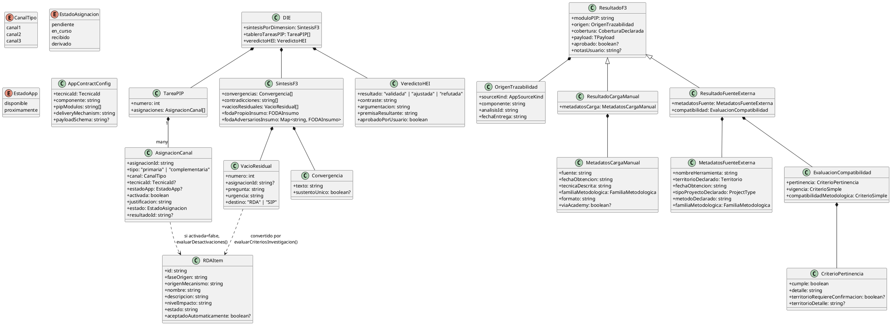
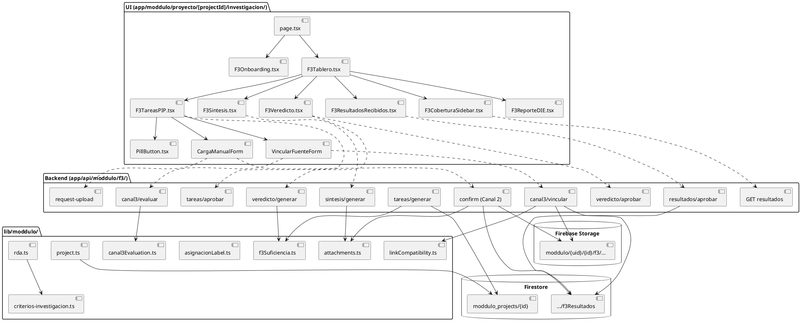
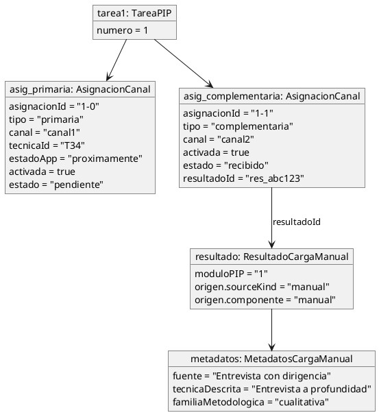
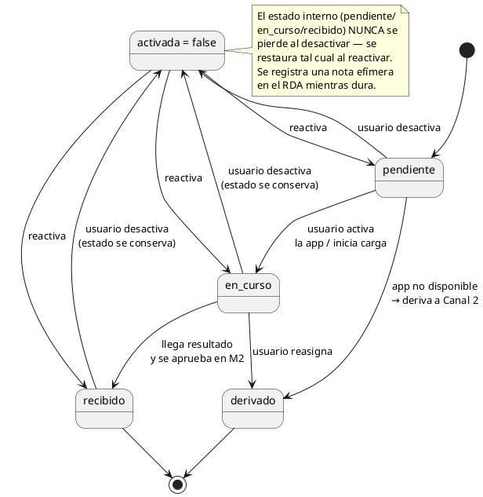
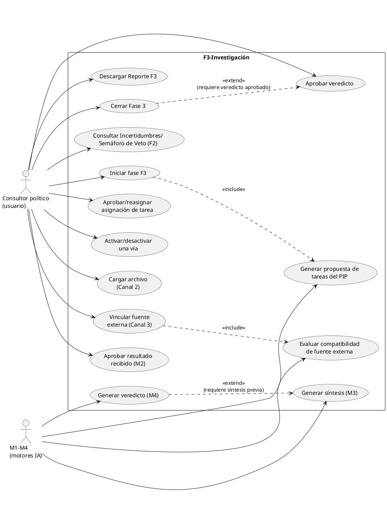
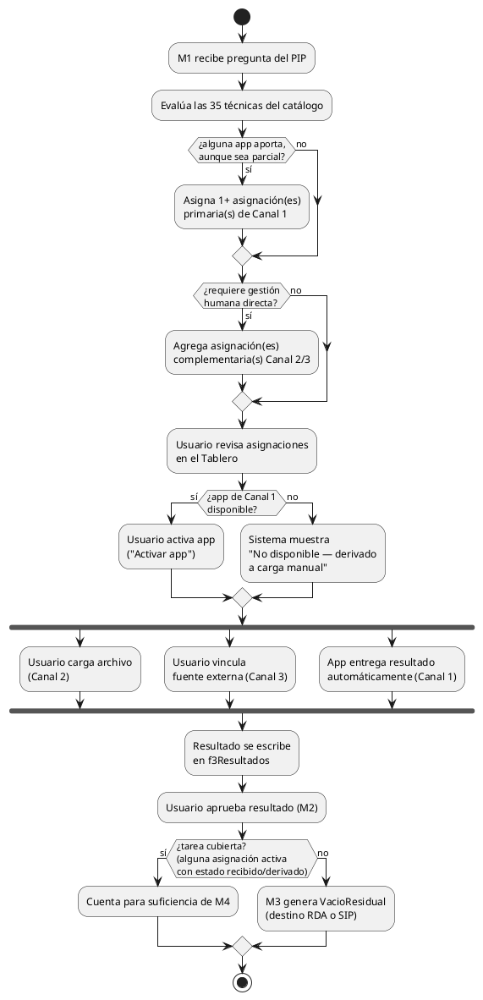
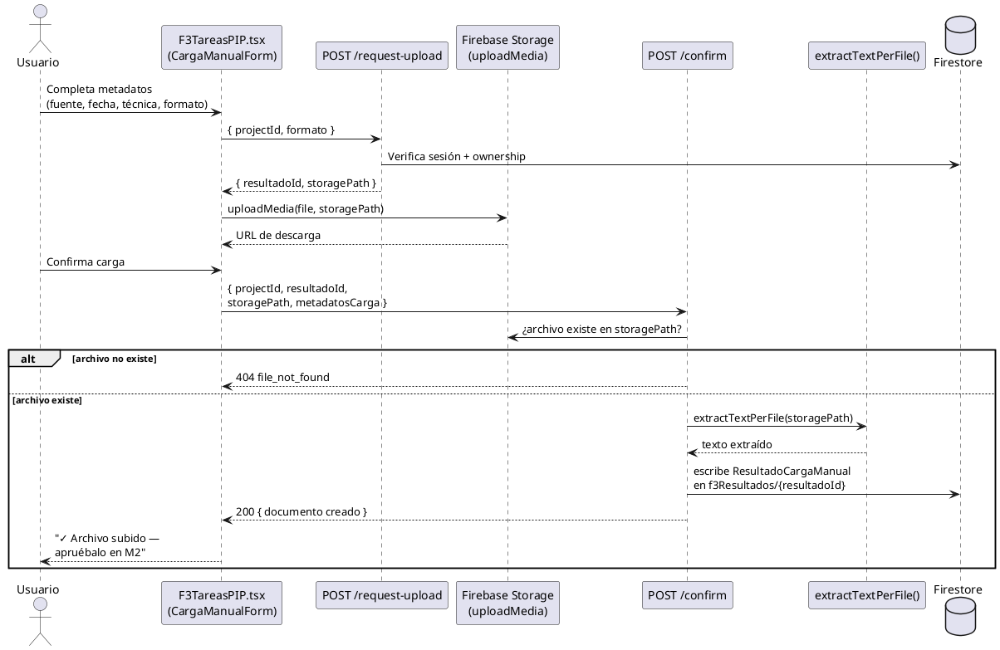
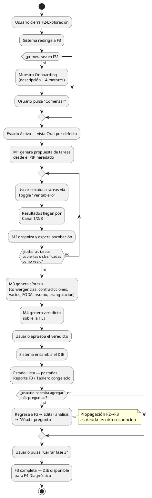

# F3-Investigación — Documentación técnica
**Moddulo / Eskemma** · Fecha de corte: 21 de julio de 2026

---

## 1. Objetivo

Orquestar el levantamiento de la información que el proyecto necesita para responder al Plan de Investigación (PIP) heredado de F2-Exploración, combinando de forma sistemática las apps del ecosistema Eskemma, la carga manual de campo, y la vinculación de fuentes externas ya existentes — y, con esa evidencia, emitir un veredicto fundamentado sobre la Hipótesis Estratégica Inicial (HEI) que sirva de base sólida para el diagnóstico de F4.

## 2. Descripción breve

F3 no investiga por sí misma: **orquesta**. Traduce cada pregunta del PIP en una o más tareas de investigación, evalúa qué apps del ecosistema (Sefix, Centinela, Recursos) pueden aportar a resolverlas, ofrece vías complementarias (carga manual, vinculación de herramientas externas) para lo que las apps no cubren o para la gestión irreductiblemente humana, recibe y organiza los resultados conforme llegan, sintetiza hallazgos (convergencias, contradicciones, vacíos residuales, e insumos de línea base para el análisis FODA), y culmina con el Dictamen de Investigación Estratégica (DIE) — el documento que valida, ajusta o refuta la hipótesis con la que el proyecto llegó a esta fase.

## 3. Arquitectura

### 3.1 Los 4 motores (columna vertebral del diseño)

| Motor | Nombre completo | Función |
|---|---|---|
| M1 | Gestor de tareas de investigación | Convierte el PIP en tareas; evalúa las 35 técnicas del catálogo MMEE para cada pregunta; asigna primero una o más apps del ecosistema (canal 1) cuando aportan, aunque sea parcialmente, y agrega vías complementarias de gestión humana cuando hace falta |
| M2 | Receptor y validador de resultados | Organiza resultados por módulo del PIP; requiere aprobación humana explícita antes de que un resultado cuente para la síntesis |
| M3 | Síntesis de hallazgos | Convergencias, contradicciones, vacíos residuales (con destino RDA o Sistema de Investigación Permanente), insumos de línea base para FODA Propio y FODA de Adversarios; señala de forma informativa cuando una convergencia descansa en una sola familia metodológica (triangulación) |
| M4 | Veredicto sobre la Hipótesis Estratégica Inicial | Contrasta la síntesis contra la HEI de F2: validada, ajustada o refutada; bloqueado hasta que cada tarea del PIP esté cubierta |

### 3.2 Los 4 canales de ingesta

| Canal | Naturaleza | Mecanismo | Estado |
|---|---|---|---|
| 1 — Ecosistema Eskemma | Apps propias (Sefix, Centinela, Recursos) | Entrega automática vía `AppContractConfig` / `APP_TO_F3_CONTRACTS` | Contrato de tipos listo; catálogo de contratos vacío, se puebla app por app |
| 2 — Campo externo (carga manual) | El usuario sube un archivo con metadatos propios | `uploadMedia()` + `extractTextPerFile()` (reutilizados de F2), técnica en texto libre, familia metodológica auto-sugerida | Implementado y verificado |
| 3 — Legado de uso independiente | Vincular una herramienta/estudio externo real ya realizado | Evaluación de compatibilidad (pertinencia dura, territorio y vigencia suaves con bypass) antes de vincular | Implementado y verificado |
| 4 — IAI (Inventario de Activos de Inteligencia) | Aprendizajes de proyectos previos | — | Fuera de alcance; pertenece a F9-Evaluación |

### 3.3 Modelo de datos (resumen — ver `data_model` en Sección 4.1)

`TareaPIP` (una por pregunta del PIP) contiene un arreglo de `AsignacionCanal` (una por vía posible de resolverla). Cada asignación tiene una etiqueta fija derivada de su canal (nunca de un campo mutable), un estado de avance, y una bandera `activada` que el usuario controla de forma independiente y reversible sin alterar el progreso registrado.

Todo resultado recibido (de cualquier canal) se persiste en la subcolección `moddulo_projects/{projectId}/f3Resultados/{resultadoId}` bajo la forma común `ResultadoF3<TPayload>`.

### 3.4 Interfaz (resumen de estados)

Onboarding → Estado Activo (chat por defecto + tablero accesible por toggle) → Estado Lista (pestañas Reporte F3 / Tablero congelado, tras veredicto aprobado). Mobile-first; sidebar derecho de escritorio se convierte en pestaña "Cobertura" en móvil.

---

## 4. Diagramas UML

### 4.1 Diagrama de clases



### 4.2 Diagrama de componentes



### 4.3 Diagrama de objetos (instantánea de ejemplo)



### 4.4 Diagrama de comportamiento (estados de una `AsignacionCanal`)



### 4.5 Diagrama de casos de uso



### 4.6 Diagrama de actividades (ciclo de vida de una pregunta del PIP)



### 4.7 Diagrama de secuencia (Canal 2 — carga manual de principio a fin)



### 4.8 Diagrama de flujo (fase completa)



---

## 5. Historias de usuario

### HU-F3-01 · Consultar el contexto heredado de F2

Como consultor político, quiero ver un resumen de mi Hipótesis Estratégica Inicial (HEI), PIP, Incertidumbres y Semáforo de Veto heredados de F2 al entrar a F3, para retomar el contexto de mi investigación sin tener que volver al reporte de F2.

Criterios de aceptación:

* Al iniciar F3, el bloque "Heredado de F2" muestra la HEI completa, con la etiqueta escrita "Hipótesis Estratégica Inicial (HEI)" en su primera aparición en pantalla.
* Se muestra el número de necesidades del PIP, de incertidumbres trasladadas a F3, y de actores del Semáforo de Veto.
* Un botón "i" junto a "Incertidumbres" abre un modal con el listado numerado de esas incertidumbres.
* Un botón "i" junto a "Semáforo de Veto" abre un modal con el detalle de los actores identificados.
* El acceso al historial de RDA está visible desde el mismo bloque, si el proyecto tiene alguno.

### HU-F3-02 · Recibir la propuesta automática de tareas del PIP

Como consultor político, quiero que el sistema evalúe automáticamente las apps del ecosistema para cada pregunta de mi PIP, para saber de entrada qué puede resolverse con una herramienta de Eskemma antes de recurrir a gestión manual.

Criterios de aceptación:

* Al iniciar el tablero, el sistema genera una tarea por cada pregunta del PIP, con al menos una asignación de vía para resolverla.
* Cuando existe una app del ecosistema aplicable, aunque sea parcialmente, aparece etiquetada como "Aplicación {nombre}" y se muestra antes que cualquier otra vía de la misma tarea.
* Cuando la pregunta requiere gestión humana directa, se agrega una asignación "Acción a realizar {carga manual/herramienta externa}" adicional, sin sustituir la anterior.
* Cada asignación muestra su propia justificación, específica de esa vía, nunca un texto genérico compartido entre asignaciones.
* Si la app asignada todavía no está construida, se muestra "No disponible aún — derivado a carga manual" en lugar de un botón de activación.

### HU-F3-03 · Activar o desactivar una vía de investigación sin perder avance

Como consultor político, quiero activar o desactivar cualquier vía propuesta para una pregunta de forma independiente, para poder cambiar de estrategia de investigación sin perder el trabajo que ya llevaba.

Criterios de aceptación:

* Cada asignación de una tarea tiene su propio selector "Activada"/"Desactivada".
* Al desactivar una vía, su estado de avance interno (Pendiente/En curso/Recibido) se conserva sin cambios, aunque el indicador visual se oculte reservando su espacio en el diseño.
* Al reactivar una vía, el indicador reaparece mostrando el mismo estado que tenía justo antes de desactivarse.
* Más de una vía de la misma pregunta puede estar activa al mismo tiempo; no es una selección excluyente.
* Al desactivar una vía, el sistema registra una nota de trazabilidad en el RDA, que desaparece automáticamente si la vía se reactiva.

### HU-F3-04 · Cargar un resultado de investigación manualmente (carga manual)

Como consultor político, quiero cargar un archivo con los resultados de una gestión propia (entrevista, encuesta, revisión documental), indicando su fuente, fecha de obtención y técnica empleada, para que quede trazado como insumo de mi investigación.

Criterios de aceptación:

* El formulario muestra una etiqueta visible (no solo un placeholder) en cada campo: Fuente, Fecha de obtención, Técnica, Tipo de archivo.
* El campo de técnica acepta texto libre, con una sugerencia automática y editable de la familia metodológica correspondiente.
* "Seleccionar archivo" se presenta como un botón real, no como un texto plano.
* El formulario incluye un botón "Cancelar" que cierra el panel sin enviar ni dejar información a medias.
* Tras confirmar con éxito, aparece un mensaje de confirmación con el nombre del archivo subido, indicando que debe aprobarse en Resultados Recibidos para vincularse a la tarea.

### HU-F3-05 · Vincular una fuente externa ya realizada

Como consultor político, quiero vincular un estudio o herramienta externa que ya contraté fuera de Eskemma, y que el sistema evalúe su compatibilidad con mi proyecto antes de aceptarlo.

Criterios de aceptación:

* El formulario pide primero el territorio de la fuente (mismo componente de selección ya usado en el resto de la plataforma), y después el resto de los datos: nombre de la herramienta, fecha de obtención, tipo de proyecto, método empleado y archivo.
* Al pulsar "Evaluar compatibilidad", el sistema muestra el resultado de la evaluación antes de permitir vincular.
* Si el tipo de proyecto declarado no coincide con el del proyecto activo, se muestra un rechazo sin ninguna opción de continuar.
* Si el territorio o la vigencia de la fuente generan una advertencia, cada una se presenta con su propio control de confirmación explícita, independiente entre sí.
* El botón "Vincular fuente" solo se habilita cuando todas las condiciones —o sus confirmaciones correspondientes— se cumplen.

### HU-F3-06 · Aprobar resultados antes de que cuenten para el análisis

Como consultor político, quiero revisar y aprobar cada resultado recibido antes de que se use en la síntesis de hallazgos, para mantener control de calidad sobre la evidencia de mi proyecto.

Criterios de aceptación:

* Cada resultado en "Resultados recibidos" muestra su origen, la cobertura declarada, y un estado "Sin revisar" por defecto.
* El selector "¿A qué pregunta del PIP responde?" muestra el texto completo de la pregunta, no solo su número.
* Si la pregunta elegida tiene más de una vía activa del mismo tipo de canal, aparece un segundo selector para precisar a cuál corresponde el resultado.
* Ningún resultado sin aprobación explícita es considerado por el sistema al generar la síntesis de hallazgos.

### HU-F3-07 · Consultar el semáforo de cobertura del PIP

Como consultor político, quiero ver en todo momento qué tan cubierta está cada pregunta de mi PIP, para saber cuánto falta antes de poder llegar al veredicto.

Criterios de aceptación:

* El panel de cobertura (sidebar en escritorio, pestaña dedicada en móvil) muestra cada pregunta completa, sin truncar el texto.
* Cada vía de una pregunta se identifica como "App: {nombre}" o "Acción: {carga manual/herramienta externa}", con la indicación de si está activada o desactivada.
* El color del indicador de estado refleja el avance real solo cuando la vía está activada; si está desactivada, se muestra en un tono neutro.
* Cada pregunta muestra además un semáforo agregado (cubierta / en curso / pendiente) que resume el conjunto de sus vías.

### HU-F3-08 · Recibir aviso de resultados nuevos en el chat

Como consultor político, quiero que el chat me informe qué resultados llegaron desde la última vez que revisé el proyecto, para no tener que recorrer manualmente todo el tablero cada vez que regreso.

Criterios de aceptación:

* Al abrir el chat, si hay resultados registrados después de mi última visita, aparece un mensaje resumiendo para qué preguntas llegó información nueva.
* El mensaje aparece una sola vez por cada apertura de la página, no de forma repetida.
* El aviso se calcula al cargar la página; no requiere que el usuario tenga la sesión abierta en tiempo real para recibirlo.

### HU-F3-09 · Consultar la síntesis de hallazgos

Como consultor político, quiero ver qué convergencias, contradicciones y vacíos encontró el sistema en mi investigación, y si algún hallazgo se sustenta en una sola fuente, para dimensionar qué tan sólida es cada conclusión.

Criterios de aceptación:

* La opción de generar la síntesis solo se habilita cuando cada pregunta del PIP está cubierta o clasificada explícitamente como vacío.
* Cualquier convergencia que dependa de resultados de una sola familia metodológica se señala visualmente como de sustento único, sin que eso impida avanzar.
* Cada vacío residual muestra su nivel de urgencia y a dónde se traslada (Registro de Deficiencias o Sistema de Investigación Permanente).
* Se presentan los insumos de línea base para el análisis FODA propio y el de adversarios.

### HU-F3-10 · Recibir el veredicto sobre la Hipótesis Estratégica Inicial

Como consultor político, quiero un veredicto claro sobre si mi hipótesis inicial se confirma, se ajusta o se descarta, junto con su argumentación, para saber en qué términos avanza mi proyecto hacia el diagnóstico.

Criterios de aceptación:

* La opción de generar el veredicto permanece bloqueada mientras alguna pregunta del PIP no esté cubierta; el contador de tareas cubiertas es siempre visible, nunca oculto.
* El veredicto muestra el resultado (validada, ajustada o refutada), el contraste contra la síntesis, la argumentación, y la premisa resultante.
* El usuario debe aprobar explícitamente el veredicto antes de que se genere el documento final de la fase.

### HU-F3-11 · Descargar el Reporte F3

Como consultor político, quiero descargar el Reporte F3 con el dictamen completo de investigación, para compartirlo con mi equipo o con mi cliente.

Criterios de aceptación:

* El botón de descarga está disponible en el encabezado desde el inicio de la fase, en la misma posición que en las fases anteriores.
* El reporte incluye todos los componentes del dictamen, con la numeración y los nombres de las apps consistentes con lo mostrado en pantalla.
* El reporte está disponible en al menos un formato portable, siguiendo el mismo criterio que ya ofrecen las fases anteriores.

### HU-F3-12 · Cerrar la Fase 3

Como consultor político, quiero cerrar formalmente la fase de investigación una vez aprobado el veredicto, para avanzar al diagnóstico con el dictamen ya como insumo fijo.

Criterios de aceptación:

* La opción de cerrar la fase solo se habilita cuando el veredicto ya fue aprobado.
* Al cerrar, la interfaz cambia a su estado final, mostrando el reporte y el tablero completo en modo de solo lectura.
* El dictamen de investigación queda disponible como insumo para la fase de diagnóstico.

### HU-F3-13 · Agregar una nueva pregunta de investigación durante la fase

Como consultor político, quiero saber cómo agregar una nueva pregunta de investigación si surge mientras trabajo en esta fase, para no perder el progreso que ya llevo.

Criterios de aceptación:

* El chat de esta fase indica explícitamente que, para agregar una pregunta nueva, debe volver a la fase de Exploración, entrar a edición del análisis, y usar la opción de añadir pregunta ahí.
* Queda reconocido como pendiente (no resuelto en esta versión) que esa pregunta nueva se refleje automáticamente en el tablero de esta fase sin intervención adicional del usuario.

## 6. Pruebas unitarias (representativas, ya ejecutadas o exigidas en el proceso de verificación)

```typescript
// lib/moddulo/f3Suficiencia.test.ts
describe("tareaCubierta", () => {
  it("es false si ninguna asignación activa tiene resultado", () => {
    const tarea = tareaConAsignaciones([{ activada: true, estado: "pendiente" }]);
    expect(tareaCubierta(tarea)).toBe(false);
  });

  it("es true si alguna asignación activa está recibida/derivada", () => {
    const tarea = tareaConAsignaciones([{ activada: true, estado: "recibido" }]);
    expect(tareaCubierta(tarea)).toBe(true);
  });

  it("es false si la única asignación con resultado está desactivada", () => {
    const tarea = tareaConAsignaciones([{ activada: false, estado: "recibido" }]);
    expect(tareaCubierta(tarea)).toBe(false);
  });

  it("al reactivar, vuelve a contar sin perder el estado previo", () => {
    const asig = { asignacionId: "1-0", activada: false, estado: "recibido" };
    const reactivada = { ...asig, activada: true };
    expect(tareaCubierta(tareaConAsignaciones([reactivada]))).toBe(true);
    expect(reactivada.estado).toBe("recibido"); // nunca se reinicia a "pendiente"
  });
});

// lib/moddulo/canal3Evaluation.test.ts
describe("evaluarCompatibilidad", () => {
  it("pertinencia.cumple = false cuando el tipo de proyecto no coincide (sin bypass posible)", () => {
    const resultado = evaluarCompatibilidad(proyecto, metadatosConTipoDistinto);
    expect(resultado.pertinencia.cumple).toBe(false);
  });

  it("territorioRequiereConfirmacion = true en mismatch/approximate, no en exact", () => {
    expect(evaluarCompatibilidad(proyecto, metadatosTerritorioMismatch).pertinencia.territorioRequiereConfirmacion).toBe(true);
    expect(evaluarCompatibilidad(proyecto, metadatosTerritorioExacto).pertinencia.territorioRequiereConfirmacion).toBeFalsy();
  });

  it("vigencia.cumple = false cuando fechaObtencion es posterior a xpcto.tiempo.fechaLimite", () => {
    const resultado = evaluarCompatibilidad(proyectoConFechaLimitePasada, metadatosRecientes);
    expect(resultado.vigencia.cumple).toBe(false);
  });

  it("compatibilidadMetodologica siempre cumple:true (declarativa)", () => {
    expect(evaluarCompatibilidad(proyecto, cualquierMetadato).compatibilidadMetodologica.cumple).toBe(true);
  });
});

// lib/moddulo/triangulacion.test.ts
describe("tareasConSustentoUnico", () => {
  it("marca una tarea cuando sus 2+ resultados aprobados son de la misma familia metodológica", () => {
    const tareas = [tareaConResultados(["cualitativa", "cualitativa"])];
    expect(tareasConSustentoUnico(tareas)).toContain(1);
  });

  it("no marca una tarea con familias metodológicas distintas", () => {
    const tareas = [tareaConResultados(["cualitativa", "cuantitativa"])];
    expect(tareasConSustentoUnico(tareas)).not.toContain(1);
  });

  it("no filtra por 'activada' — considera cualquier resultado aprobado", () => {
    const tareas = [tareaConResultados(["cualitativa", "cualitativa"], { asig2Desactivada: true })];
    expect(tareasConSustentoUnico(tareas)).toContain(1);
  });

  it("requiere al menos 2 resultados aprobados para evaluar (1 solo no es 'sustento único' ni diverso)", () => {
    const tareas = [tareaConResultados(["cualitativa"])];
    expect(tareasConSustentoUnico(tareas)).not.toContain(1);
  });
});

// lib/moddulo/project.test.ts
describe("normalizeTareaPIP", () => {
  it("reconstruye una asignación primaria desde el esquema legado plano", () => {
    const legado = { canalAsignado: "canal2", estado: "recibido", resultadoId: "x" };
    const normalizada = normalizeTareaPIP(legado);
    expect(normalizada.asignaciones).toHaveLength(1);
    expect(normalizada.asignaciones[0].activada).toBe(true); // default aplicado
  });

  it("normaliza 'activada' a true por defecto si falta en asignaciones ya en array", () => {
    const sinActivada = { asignaciones: [{ asignacionId: "1-0", canal: "canal1" }] };
    expect(normalizeTareaPIP(sinActivada).asignaciones[0].activada).toBe(true);
  });
});
```

## 7. Especificaciones de componentes de React

| Componente | Props principales | Responsabilidad |
|---|---|---|
| `F3Onboarding.tsx` | `onComenzar: () => void` | Landing de bienvenida a la fase; describe los 4 motores |
| `F3Tablero.tsx` | `readOnly?: boolean`, `project`, `resultados`, `onRefresh` | Contenedor de M1-M4; único componente para estado Activo editable y estado Lista congelado |
| `F3TareasPIP.tsx` | `tareas: TareaPIP[]`, `pip: PIPItem[]`, `onRefresh` | Renderiza tarjetas de tarea; ordena canal1 antes que canal2/3; incluye `CargaManualForm` y `VincularFuenteForm` internos |
| `F3ResultadosRecibidos.tsx` | `resultados: ResultadoF3[]`, `pip: PIPItem[]`, `onAprobar` | Lista de resultados por módulo del PIP; selects de tarea/asignación con texto completo de la pregunta |
| `F3Sintesis.tsx` | `sintesis: SintesisF3 \| null`, `onGenerar` | Convergencias (con indicador de sustento único), contradicciones, vacíos, FODA insumo |
| `F3Veredicto.tsx` | `veredicto: VeredictoHEI \| null`, `tareas: TareaPIP[]`, `onGenerar`, `onAprobar` | Veredicto o contador "N de M tareas cubiertas" |
| `F3CoberturaSidebar.tsx` | `tareas: TareaPIP[]`, `pip: PIPItem[]` | Sidebar desktop / pestaña "Cobertura" mobile; formato `App:`/`Acción:` + Activada/Desactivada + burbuja de color |
| `F3ReporteDIE.tsx` | `die: DIE` | Los 8 componentes del DIE en modo lectura |
| `PillButton.tsx` | `variant: "outline" \| "solid"`, `onClick`, `children` | Único componente de botón pill extraído para reutilización entre F1/F2/F3 |
| `CargaManualForm` (interno de `F3TareasPIP.tsx`) | `tareaNumero`, `asignacionId`, `onSuccess`, `onCancel` | Formulario de Canal 2: fuente, fecha, técnica libre + familia sugerida, archivo, cancelar |
| `VincularFuenteForm` (interno de `F3TareasPIP.tsx`) | `tareaNumero`, `asignacionId`, `onSuccess`, `onCancel` | Mini-flujo de 2 pasos: `TerritorySelector` → resto de campos + evaluar/checkbox/vincular |

## 8. Criterios de aceptación de la fase

- [x] El usuario puede completar el ciclo completo Onboarding → Activo → Lista → Cerrar Fase 3 sin errores.
- [x] M1 genera al menos una asignación de Canal 1 para cualquier pregunta donde exista una técnica del catálogo MMEE aplicable, aunque sea parcialmente (auditado con 12 preguntas incluyendo 5 adversariales/confidenciales).
- [x] Ninguna pregunta pierde su parte de gestión humana solo por tener ya una asignación de ecosistema.
- [x] Los 4 canales (1-3 implementados, 4 fuera de alcance) escriben a la misma subcolección `f3Resultados` bajo el mismo contrato `ResultadoF3`.
- [x] Ningún resultado cuenta para la síntesis sin aprobación humana explícita en M2.
- [x] El veredicto de M4 está bloqueado hasta que cada tarea del PIP esté cubierta o clasificada como vacío residual.
- [x] Activar/desactivar una asignación nunca destruye su estado de avance interno.
- [x] Toda desactivación queda trazada de forma efímera en el RDA, auto-aceptada, y desaparece al reactivar.
- [x] Ningún término de jerga interna (Canal 1/2/3, DVS, TecnicaId) es visible para el usuario final.
- [x] La interfaz funciona correctamente en 380px (mobile-first) y en desktop (≥1024px).
- [x] La triangulación metodológica se señala de forma informativa en la síntesis, sin bloquear el veredicto.
- [x] `APP_TO_F3_CONTRACTS` puede poblarse técnica por técnica sin requerir cambios estructurales al resto del sistema.

## 9. Decisiones de diseño documentadas

1. **Diseño primero, código después.** Toda decisión de arquitectura o negocio se resuelve en conversación antes de convertirse en instrucción para Code; Code implementa y reporta con evidencia real, nunca decide alcance por su cuenta sin plantear la pregunta.
2. **Verificación empírica obligatoria.** Ninguna pieza se aprueba por "debería funcionar" — se exige evidencia real (HTTP contra servidor real, Firestore/Storage reales, capturas Puppeteer en ambos breakpoints) en cada entrega.
3. **Reutilizar antes que duplicar; duplicar solo con razón explícita.** `uploadMedia()`/`extractTextPerFile()` se reutilizaron de F2 en vez de construir una utilidad nueva de URL firmada. El único patrón clonado deliberadamente (landing/tabs/botón de F1/F2) lo fue porque es JSX puro sin lógica de negocio — riesgo de duplicación visual, no de datos.
4. **Nunca exponer jerga interna al usuario.** `TecnicaId`, "Canal 1/2/3", "DVS", y la distinción interna `tipo: primaria/complementaria` no son vocabulario de cara al usuario — se resuelven a nombres comerciales y lenguaje llano en cada punto de la interfaz.
5. **Canal 1 es siempre la opción prioritaria de evaluación, nunca la obligatoria.** M1 evalúa las 35 técnicas del catálogo antes de recurrir a gestión humana, pero nunca fuerza una asignación de ecosistema donde ninguna aplica, y nunca omite la gestión humana donde de verdad se necesita.
6. **Activar/desactivar es independiente, no exclusivo.** Más de una asignación de una tarea puede estar activa simultáneamente; desactivar una no reasigna el rol "primaria" de otra — la etiqueta visible se deriva del canal, nunca de un campo mutable.
7. **La triangulación es informativa, no un gate.** Exigir diversidad metodológica como requisito bloqueante contradiría que, mientras el ecosistema se sigue construyendo app por app, muchas preguntas legítimamente solo tienen una vía disponible.
8. **Editabilidad universal con propagación multidireccional.** Ninguna fase se "cierra" de forma irreversible; los cambios se propagan hacia fases anteriores y posteriores. La propagación automática F2→F3 al agregar una pregunta nueva queda reconocida como deuda técnica explícita, no resuelta en este ciclo.
9. **Mobile-first en todo el diseño de interfaz**, con el sidebar de escritorio convertido siempre en pestaña equivalente en mobile, nunca oculto.
10. **Todo contrato de vuelta hacia F3 (`AppContractConfig`) se diseña junto con la arquitectura funcional de cada app**, no como una tarea de integración aparte al final.
