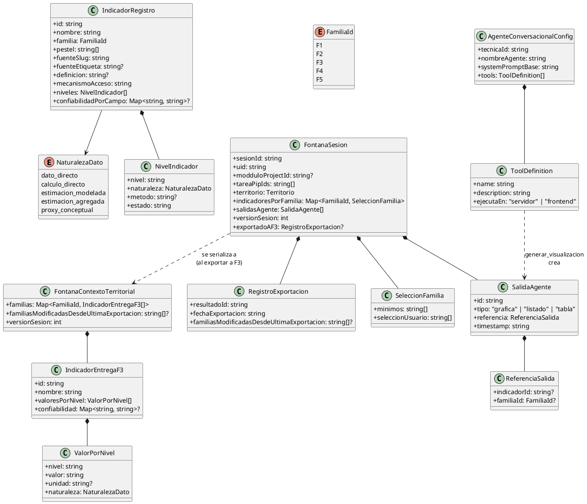
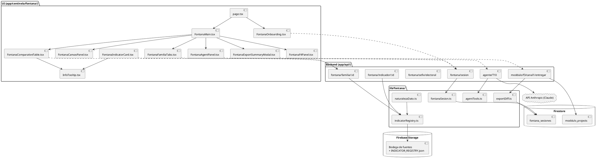
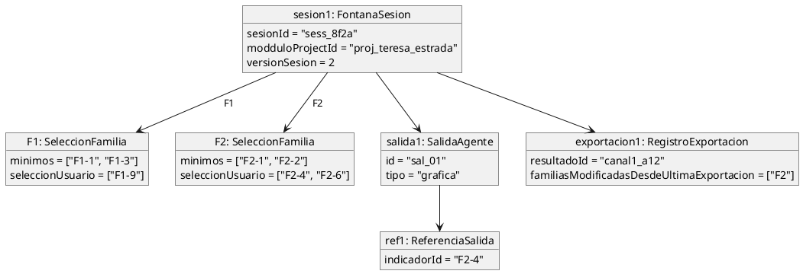
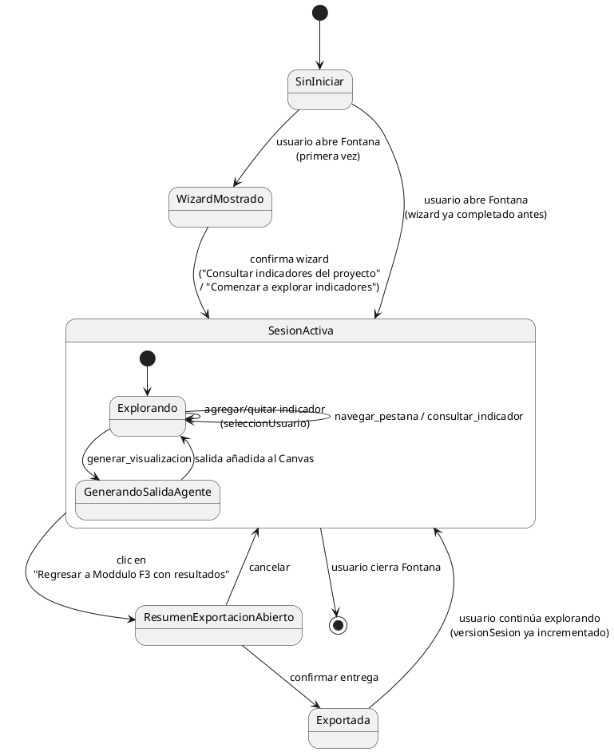
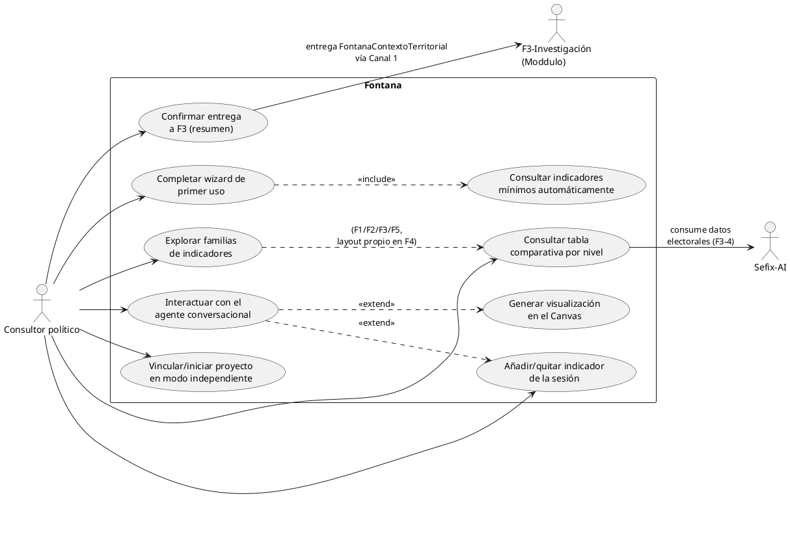
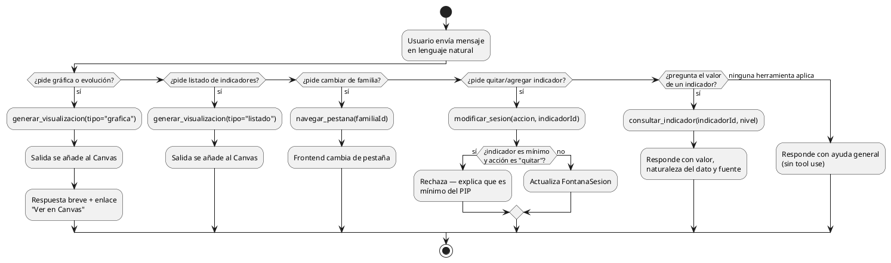
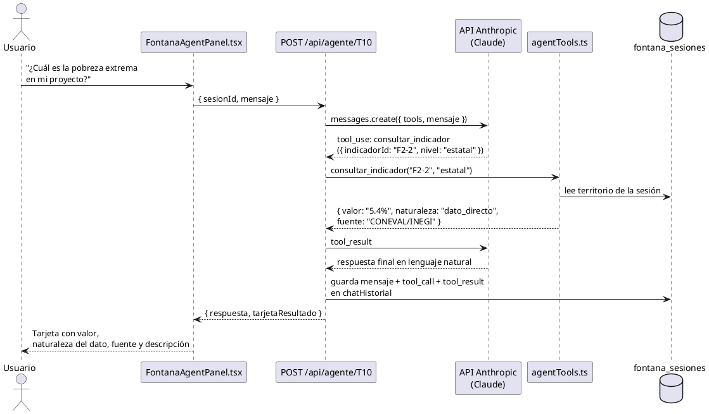
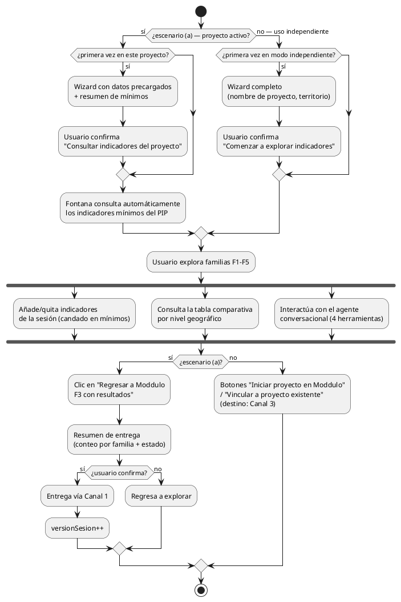

# Fontana (T10)

*Análisis de datos abiertos institucionales — Centinela*

Eskemma · Ecosistema digital · Julio 2026

**Documentos de origen:** `Fontana_T10_Cierre_Paso2_v2.md` (catálogo de indicadores) · `Fontana_T10_Arquitectura_Paso3_v2.md` (arquitectura funcional) · `Fontana_T10_Cierre_Paso4.md` (prototipo interactivo y agente conversacional) · `fontana_prototipo.jsx` (prototipo de referencia de interacción).

> **Nota de plantilla:** este documento sigue la misma estructura usada para las fases de Moddulo (F1, F2, F3), adaptada a que Fontana es una app del ecosistema, no una fase. En la sección 3.6 se documenta explícitamente dónde esa adaptación fue necesaria (Fontana no emite un "Dictamen de Coherencia" del tipo XPCTO/HEI; su integración con la API de Claude es el agente conversacional definido en el Paso 4).

---

## 1. Objetivo

Procesar datos institucionales públicos de México — y, en una fase posterior, de Iberoamérica — para producir información estructurada, verificable y con trazabilidad de fuente, que alimente tanto la interfaz propia de Fontana en Centinela como al resto del ecosistema Eskemma (en particular a Sefix-AI, vía F3-Investigación de Moddulo). Fontana existe para que un consultor político no tenga que salir de la plataforma a buscar manualmente datos de INEGI, CONEVAL, CONAPO, Banxico u otras fuentes abiertas, y para que esos datos, cuando se usan en un proyecto, queden documentados con su naturaleza (dato directo, estimación, proxy) y su fuente — nunca como una cifra sin procedencia.

## 2. Descripción breve

Fontana es la primera app de datos abiertos del ecosistema y vive dentro de **Centinela**, el hub de monitoreo de Eskemma. Organiza 84 indicadores en 5 familias (Sociodemográficos, Socioeconómicos, Geopolíticos, Comparación internacional, Características territoriales) y los presenta en tablas comparativas por nivel geográfico (nacional, estatal, distrital/municipal, AGEB según el tipo de proyecto). Opera en tres escenarios: **(a)** dentro de un proyecto activo de Moddulo, donde precarga y entrega automáticamente los indicadores mínimos que exige el Programa de Investigación Profunda (PIP) de F3; y **(b)/(c)** en uso independiente dentro de Centinela, sin proyecto de referencia. Incluye un agente conversacional ("Fontana") que permite consultar indicadores, modificar la sesión de trabajo y generar gráficas o listados en lenguaje natural, sin sustituir la navegación directa por pestañas.

---

## 3. Arquitectura

### 3.1 Stack técnico

| Capa | Tecnología |
|---|---|
| Frontend | Next.js 14 (App Router), React, TypeScript, Tailwind CSS |
| Backend | Next.js API routes (`app/api/`) sobre Vercel/Node — mismo patrón que el resto de Eskemma, sin Cloud Functions de Firebase independientes |
| Base de datos | Firestore (sesiones de Fontana, bookkeeping de entrega a F3) |
| Almacenamiento de datos crudos | Firebase Storage — bodega versionada de fuentes (INEGI, CONEVAL, CONAPO, Banxico, etc.), con manifiestos `_manifest.json` por fuente |
| IA conversacional | API de Anthropic (Claude), vía Messages API con tool use — agente "Fontana" (sección 3.6) |
| Gráficas del Canvas | Recharts (frontend) |
| Autenticación | Firebase Auth, reutilizada tal cual del resto de Eskemma (`getSessionFromRequest`) |

### 3.2 Estructura de rutas Next.js relevantes para Fontana

```
app/
├── centinela/
│   └── fontana/
│       ├── page.tsx                      # Entry point — decide wizard vs. app según sesión
│       ├── FontanaOnboarding.tsx          # Wizard de primer uso (escenarios a / b-c)
│       ├── FontanaMain.tsx                # Contenedor principal (post-wizard)
│       ├── FontanaFamiliaTabs.tsx
│       ├── FontanaIndicatorCard.tsx
│       ├── FontanaComparativeTable.tsx
│       ├── FontanaF4Panel.tsx             # Layout propio de Familia 4
│       ├── FontanaCanvasPanel.tsx
│       ├── FontanaAgentPanel.tsx          # Sidebar desktop / bottom sheet mobile
│       ├── FontanaExportSummaryModal.tsx
│       └── InfoTooltip.tsx                # Compartido — ya usado en PESTEL
│
└── api/
    ├── fontana/
    │   ├── sesion/
    │   │   ├── route.ts                  # GET/POST — leer o crear FontanaSesion
    │   │   └── [sesionId]/route.ts       # PATCH — modificar sesión (agregar/quitar indicador)
    │   ├── familia/[familiaId]/route.ts  # GET — indicadores de una familia por territorio/nivel
    │   ├── indicador/[id]/route.ts       # GET — un indicador puntual
    │   └── sefix/electoral/route.ts      # GET — consumo de datos electorales de Sefix
    ├── agente/
    │   └── [tecnicaId]/route.ts          # POST — genérico, usado por Fontana con tecnicaId="T10"
    └── moddulo/f3/canal1/
        └── entregar/route.ts             # POST — compartido con el resto del ecosistema (Paso 3, § 5.3)
```

### 3.3 Modelo de datos Firestore

Fontana usa una colección propia a nivel raíz — no anida bajo `moddulo_projects` porque una sesión de Fontana puede existir sin proyecto (escenarios b/c):

```
fontana_sesiones/{sesionId}
  uid: string                       // dueño de la sesión, para reglas de seguridad
  modduloProjectId?: string         // presente solo en escenario (a)
  tareaPipIds: string[]
  territorio: { cveGeo: string, nivel: string }
  indicadoresPorFamilia: {
    F1: { minimos: string[], seleccionUsuario: string[] },
    F2: { minimos: string[], seleccionUsuario: string[] },
    F3: { minimos: string[], seleccionUsuario: string[] },
    F4: { minimos: string[], seleccionUsuario: string[] },
    F5: { minimos: string[], seleccionUsuario: string[] }
  }
  salidasAgente: SalidaAgente[]      // Canvas — ver Paso 3 v2, § 8.3
  fechaUltimoGuardado: Timestamp
  versionSesion: number
  exportadoAF3?: {
    resultadoId: string
    fechaExportacion: Timestamp
    familiasModificadasDesdeUltimaExportacion?: string[]
  }

fontana_sesiones/{sesionId}/chatHistorial/{mensajeId}
  role: "user" | "agent" | "tool_call" | "tool_result"
  contenido: string | object
  timestamp: Timestamp
```

El catálogo de indicadores (`INDICATOR_REGISTRY.json`, esquema fijado en el Paso 3 v2 § 7) **no vive en Firestore** — es un artefacto versionado en la bodega de Firebase Storage, igual que las fuentes crudas. Firestore solo almacena estado de sesión e interacción del usuario, nunca el catálogo ni los valores de los indicadores en sí (esos se sirven en tiempo real desde la capa de servicio, que lee de la bodega).

### 3.4 Reglas de seguridad Firestore (Firestore Security Rules)

```
rules_version = '2';
service cloud.firestore {
  match /databases/{database}/documents {

    match /fontana_sesiones/{sesionId} {
      // Lectura y edición solo por el dueño de la sesión
      allow read, update, delete: if request.auth != null
                                   && request.auth.uid == resource.data.uid;

      // Creación: el uid del documento debe coincidir con el usuario autenticado,
      // y si declara modduloProjectId, ese proyecto debe pertenecerle también
      allow create: if request.auth != null
                    && request.auth.uid == request.resource.data.uid
                    && (
                         !("modduloProjectId" in request.resource.data)
                         || get(/databases/$(database)/documents/moddulo_projects/$(request.resource.data.modduloProjectId)).data.uid == request.auth.uid
                       );

      match /chatHistorial/{mensajeId} {
        allow read, create: if request.auth != null
                             && get(/databases/$(database)/documents/fontana_sesiones/$(sesionId)).data.uid == request.auth.uid;
        // El historial de chat no se edita ni se borra mensaje por mensaje
        allow update, delete: if false;
      }
    }
  }
}
```

Nota de diseño: se evaluó anidar `fontana_sesiones` bajo `moddulo_projects/{projectId}` (como hace `f3Resultados` en F3), pero se descartó — obligaría a que toda sesión tuviera un proyecto, contradiciendo los escenarios (b)/(c) de uso independiente. Se prefirió una colección raíz con `modduloProjectId` opcional, validado por `get()` solo cuando está presente.

### 3.5 Contrato de API — rutas relevantes para Fontana

| Ruta | Método | Descripción |
|---|---|---|
| `/api/fontana/sesion` | `GET` | Recupera la sesión activa del usuario (por `modduloProjectId` o `sesionId` independiente) |
| `/api/fontana/sesion` | `POST` | Crea una sesión nueva — ejecutada al confirmar el wizard |
| `/api/fontana/sesion/:sesionId` | `PATCH` | `{ accion: "agregar"\|"quitar", familiaId, indicadorId }` — rechaza `quitar` si el indicador está en `minimos` |
| `/api/fontana/familia/:familiaId` | `GET` | `?territorio=&nivel=&indicadores=` — un endpoint por familia, no uno por cada uno de los 84 indicadores |
| `/api/fontana/indicador/:id` | `GET` | `?territorio=` — usado por la herramienta `consultar_indicador` del agente |
| `/api/fontana/sefix/electoral` | `GET` | Consumo de resultados electorales ya calculados por Sefix (Familia 3) — Fontana nunca los recalcula |
| `/api/agente/T10` | `POST` | Endpoint genérico de agente conversacional (reutilizable por otras apps futuras), instanciado para Fontana |
| `/api/moddulo/f3/canal1/entregar` | `POST` | Compartido con el resto del ecosistema — ver Paso 3 v2, § 5.3, incluye ahora la confirmación previa del resumen de entrega |

Ejemplo — `PATCH /api/fontana/sesion/:sesionId` (rechazo de un mínimo):

```json
// Request
{ "accion": "quitar", "familiaId": "F2", "indicadorId": "F2-2" }

// Response 409
{
  "error": "indicador_es_minimo",
  "mensaje": "No se puede quitar: F2-2 es un indicador mínimo del PIP para este proyecto."
}
```

### 3.6 Llamada a la API de Claude — agente conversacional de Fontana

> **Nota de adaptación:** Fontana no tiene un mecanismo de "Dictamen de Coherencia" equivalente al XPCTO de F1 o al Veredicto HEI de F3 — no emite un veredicto sobre una hipótesis. Su punto de integración real con la API de Claude es el **agente conversacional** diseñado en el Paso 4, que usa tool use (function calling) en vez de generación de un documento de cierre. Esta sección documenta ese mecanismo, que cumple el mismo rol arquitectónico (ser el punto donde Fontana llama a Claude) aunque con un propósito distinto.

```typescript
interface AgenteConversacionalConfig {
  tecnicaId: "T10";
  nombreAgente: "Fontana";
  mensajeBienvenida: string;
  systemPromptBase: string;   // incluye reglas: nunca exponer TecnicaId, sin emojis,
                               // rechazar quitar mínimos, contextualizar al territorio
  tools: ToolDefinition[];    // las 4 herramientas, Paso 4 § 6.2
  coleccionPersistencia: "fontana_sesiones/{sesionId}/chatHistorial";
}
```

Llamada representativa a `POST https://api.anthropic.com/v1/messages`:

```json
{
  "model": "claude-sonnet-4-6",
  "max_tokens": 1024,
  "system": "Eres Fontana, el asistente de datos abiertos de Centinela. Nunca uses emojis. Nunca menciones TecnicaId ni jerga interna. Si el usuario pide quitar un indicador mínimo del PIP, rechaza la acción explicando el motivo...",
  "messages": [
    { "role": "user", "content": "¿Cuál es la pobreza extrema en mi proyecto?" }
  ],
  "tools": [
    {
      "name": "consultar_indicador",
      "description": "Consulta el valor de un indicador de Fontana para un nivel geográfico del proyecto activo.",
      "input_schema": {
        "type": "object",
        "properties": {
          "indicadorId": { "type": "string" },
          "nivel": { "type": "string", "enum": ["nacional", "estatal", "distrital", "municipal"] }
        },
        "required": ["indicadorId", "nivel"]
      }
    }
  ]
}
```

El servidor recibe el bloque `tool_use`, ejecuta la lógica correspondiente (para `consultar_indicador` y `modificar_sesion`, en el propio backend; para `navegar_pestana` y `generar_visualizacion`, reenviándola como evento de UI al frontend — Paso 4 § 6.2), y reingresa el `tool_result` a Claude para obtener la respuesta final en lenguaje natural, que se persiste en `chatHistorial` junto con el registro de la llamada a herramienta.

---

## 4. Diagramas UML (PlantUML)

### 4.1 Diagrama de clases



### 4.2 Diagrama de componentes



### 4.3 Diagrama de objetos (instantánea de ejemplo)



### 4.4 Diagrama de comportamiento (statechart de la sesión)



### 4.5 Diagrama de casos de uso



### 4.6 Diagrama de actividades (decisión de herramienta del agente)



### 4.7 Diagrama de secuencia (consulta al agente con tool use)



### 4.8 Diagrama de flujo (uso completo de la app)



---

## 5. Historias de usuario

### HU-Fontana-01 · Completar el wizard de primer uso (proyecto activo)

Como consultor político, quiero que Fontana me muestre los datos de mi proyecto ya precargados la primera vez que la abro, para confirmar de un vistazo qué se va a consultar antes de empezar.

Criterios de aceptación:
* El wizard muestra nombre del proyecto, ruta territorial y tarea PIP, sin que el usuario tenga que capturarlos.
* Se muestra un resumen del número de indicadores mínimos por familia.
* El botón "Consultar indicadores del proyecto" es la única acción disponible para avanzar.
* En aperturas posteriores del mismo proyecto, el wizard no vuelve a aparecer.

### HU-Fontana-02 · Completar el wizard de primer uso (modo independiente)

Como consultor político, quiero poder usar Fontana sin un proyecto de Moddulo, capturando solo el territorio que me interesa, para explorar datos abiertos de forma exploratoria.

Criterios de aceptación:
* El wizard pide nombre de proyecto (opcional) y territorio.
* No se muestra ningún resumen de mínimos, porque no existe un PIP de referencia.
* El botón "Comenzar a explorar indicadores" habilita el resto de la app con una sesión sin mínimos.

### HU-Fontana-03 · Consultar automáticamente los indicadores mínimos del PIP

Como consultor político, quiero que, al confirmar el wizard en un proyecto activo, Fontana ya tenga resueltos los indicadores que mi PIP exige, para no tener que ir a buscarlos manualmente uno por uno.

Criterios de aceptación:
* Los indicadores marcados como mínimos en el PIP aparecen precargados en sus respectivas familias al entrar por primera vez a la sesión.
* Cada mínimo muestra un candado y no ofrece control de "quitar".
* Si un mínimo no tiene dato disponible en algún nivel, se muestra el motivo explícito, nunca una celda vacía.

### HU-Fontana-04 · Explorar familias de indicadores

Como consultor político, quiero navegar entre las 5 familias de indicadores mediante pestañas, para revisar distintos aspectos del territorio sin perder mi selección previa.

Criterios de aceptación:
* Cada pestaña muestra el conteo de indicadores en sesión para esa familia.
* Cambiar de pestaña no modifica la sesión de ninguna otra familia.
* La Familia 4 (Comparación internacional) se presenta en un layout propio, sin niveles subnacionales.

### HU-Fontana-05 · Añadir un indicador a la sesión

Como consultor político, quiero añadir indicadores adicionales a los mínimos del PIP, para ampliar mi análisis según lo que necesite en cada proyecto.

Criterios de aceptación:
* El selector "+ Añadir indicador" solo muestra indicadores de la familia activa que aún no están en la sesión.
* El indicador añadido aparece de inmediato en la tabla comparativa.
* La acción queda reflejada en `seleccionUsuario`, nunca en `minimos`.

### HU-Fontana-06 · Intentar quitar un indicador mínimo (rechazo)

Como consultor político, quiero que el sistema me impida quitar un indicador exigido por el PIP, incluso si lo intento por accidente, para no comprometer sin darme cuenta la cobertura que Moddulo espera de mi proyecto.

Criterios de aceptación:
* No existe control de "quitar" visible sobre un indicador mínimo en la interfaz directa.
* Si se solicita la misma acción vía el agente conversacional, la respuesta explica que es un mínimo del PIP y no se ejecuta el cambio.
* Ningún mínimo puede quedar fuera de la sesión mientras el proyecto siga activo.

### HU-Fontana-07 · Consultar la tabla comparativa por nivel geográfico

Como consultor político, quiero ver el valor de cada indicador en distintos niveles geográficos a la vez, con su naturaleza de dato y su fuente, para entender qué tan confiable es cada cifra antes de usarla en mi análisis.

Criterios de aceptación:
* Cada celda con dato muestra su naturaleza (dato directo, cálculo directo, estimación modelada, estimación agregada o proxy conceptual) con un tratamiento visual minimalista (borde, no relleno sólido).
* Cada celda muestra la fuente del dato, en texto discreto.
* Cada celda sin dato disponible muestra el motivo explícito por el cual no aplica o no está disponible.
* Las columnas ofrecidas corresponden al tipo de proyecto (electoral: nacional/estatal/distrital/municipal; otros: nacional/estatal/municipal/AGEB).

### HU-Fontana-08 · Consultar la definición de un indicador

Como consultor político, quiero poder ver la definición conceptual de un indicador y su fuente oficial sin salir de la pantalla donde lo estoy revisando, para interpretarlo correctamente sin tener que buscarlo por mi cuenta.

Criterios de aceptación:
* Un ícono de información junto al nombre del indicador abre un tooltip al hacer clic.
* El tooltip muestra el nombre, la definición y la fuente, en el formato "Nombre: definición. (Fuente)".
* El tooltip se cierra al hacer clic fuera de él.

### HU-Fontana-09 · Consultar un indicador por lenguaje natural

Como consultor político, quiero preguntarle a Fontana el valor de un indicador en lenguaje natural, para no tener que navegar manualmente hasta encontrarlo si ya sé qué busco.

Criterios de aceptación:
* La respuesta incluye el valor, el nivel geográfico consultado, la naturaleza del dato y la fuente, contextualizados al territorio del proyecto.
* La respuesta incluye una descripción breve (máximo 2 líneas) del indicador.
* Si no hay dato disponible en ese nivel, la respuesta explica el motivo en vez de solo indicar ausencia de datos.

### HU-Fontana-10 · Modificar la sesión por lenguaje natural

Como consultor político, quiero poder pedirle al agente que añada o quite un indicador de mi sesión, para no tener que interrumpir la conversación y volver a la interfaz manual.

Criterios de aceptación:
* Una petición de "añadir" agrega el indicador a `seleccionUsuario` y lo refleja de inmediato en la tabla comparativa.
* Una petición de "quitar" sobre un indicador que no es mínimo lo remueve de la sesión.
* Una petición de "quitar" sobre un mínimo se rechaza con una explicación (ver HU-Fontana-06).

### HU-Fontana-11 · Generar una gráfica o listado desde el chat

Como consultor político, quiero pedirle al agente una gráfica de evolución o un listado completo de indicadores, y verlo en un espacio con suficiente lugar para leerlo, para no tener que interpretar una tabla comprimida dentro de la burbuja de chat.

Criterios de aceptación:
* La respuesta del agente en el chat es breve, con un enlace "Ver en Canvas".
* La gráfica o el listado se genera en la pestaña "Agente · Resultados" (Canvas), separada de las 5 familias de indicadores.
* Las salidas del Canvas persisten en la sesión mientras esta permanezca abierta.
* Las salidas del Canvas nunca se incluyen en el payload de entrega a F3.

### HU-Fontana-12 · Navegar entre familias por lenguaje natural

Como consultor político, quiero pedirle al agente que me lleve a otra familia de indicadores, para no tener que soltar la conversación y buscar la pestaña manualmente.

Criterios de aceptación:
* Una petición de navegación cambia la pestaña activa de la interfaz.
* La sesión de la familia de origen no se modifica al cambiar de pestaña.

### HU-Fontana-13 · Revisar el resumen de entrega antes de enviar a F3

Como consultor político, quiero ver qué se va a enviar a Moddulo antes de confirmar la entrega, para saber con certeza qué familias cambiaron desde la última vez que envié resultados.

Criterios de aceptación:
* Al pulsar "Regresar a Moddulo F3 con resultados" se abre un resumen con el conteo de indicadores por familia.
* Cada familia muestra su estado respecto al último envío confirmado: nunca enviada, modificada o sin cambios.
* Solo al confirmar explícitamente se ejecuta la entrega real; el usuario puede cancelar sin que se pierda su sesión.

### HU-Fontana-14 · Usar Fontana sin proyecto activo y vincularlo después

Como consultor político, quiero poder explorar indicadores de forma independiente y, si el resultado me sirve, iniciar o vincular un proyecto en Moddulo con lo que ya exploré, para no perder el trabajo hecho antes de decidir si amerita un proyecto formal.

Criterios de aceptación:
* En modo independiente, los botones "Iniciar proyecto en Moddulo" y "Vincular a proyecto existente" están siempre visibles.
* Ambos botones dirigen al mecanismo de Canal 3 de F3 (evaluación de pertinencia/vigencia/territorio), nunca a Canal 1.
* La sesión independiente conserva sus indicadores seleccionados durante ese proceso.

---

## 6. Pruebas unitarias

```typescript
// lib/fontana/fontanaSesion.test.ts
describe("modificarSesion", () => {
  it("rechaza quitar un indicador que está en minimos", () => {
    const sesion = sesionConFamilia("F2", { minimos: ["F2-2"], seleccionUsuario: [] });
    const resultado = modificarSesion(sesion, { accion: "quitar", familiaId: "F2", indicadorId: "F2-2" });
    expect(resultado.error).toBe("indicador_es_minimo");
  });

  it("permite quitar un indicador de seleccionUsuario", () => {
    const sesion = sesionConFamilia("F2", { minimos: [], seleccionUsuario: ["F2-6"] });
    const resultado = modificarSesion(sesion, { accion: "quitar", familiaId: "F2", indicadorId: "F2-6" });
    expect(resultado.sesion.indicadoresPorFamilia.F2.seleccionUsuario).not.toContain("F2-6");
  });

  it("agregar un indicador ya presente no lo duplica", () => {
    const sesion = sesionConFamilia("F1", { minimos: ["F1-1"], seleccionUsuario: [] });
    const resultado = modificarSesion(sesion, { accion: "agregar", familiaId: "F1", indicadorId: "F1-1" });
    expect(resultado.sesion.indicadoresPorFamilia.F1.seleccionUsuario).toHaveLength(0);
  });
});

// lib/fontana/naturalezaDato.test.ts
describe("resolverCeldaTabla", () => {
  it("regresa motivo explícito cuando no hay dato en un nivel", () => {
    const indicador = indicadorConNivel("distrital", { v: null, motivo: "CONEVAL no calcula a nivel distrital" });
    const celda = resolverCeldaTabla(indicador, "distrital");
    expect(celda.motivo).toBeDefined();
    expect(celda.valor).toBeNull();
  });

  it("nunca regresa una celda sin valor ni motivo", () => {
    const indicador = indicadorConNivel("municipal", { v: "12.3%", n: "dato_directo" });
    const celda = resolverCeldaTabla(indicador, "municipal");
    expect(celda.valor || celda.motivo).toBeTruthy();
  });
});

// lib/fontana/exportDiff.test.ts
describe("calcularFamiliasModificadas", () => {
  it("marca todas las familias como modificadas si nunca se ha exportado", () => {
    const sesion = sesionSinExportar();
    expect(calcularFamiliasModificadas(sesion, null)).toEqual(["F1", "F2", "F3", "F4", "F5"]);
  });

  it("solo marca las familias con diferencias respecto al último snapshot", () => {
    const snapshot = snapshotDe(sesionBase());
    const sesionModificada = conIndicadorAgregado(sesionBase(), "F3", "F3-9");
    expect(calcularFamiliasModificadas(sesionModificada, snapshot)).toEqual(["F3"]);
  });

  it("el payload de exportación siempre incluye las 5 familias, aunque solo 1 cambió", () => {
    const payload = construirPayloadExportacion(sesionModificada, snapshot);
    expect(Object.keys(payload.familias)).toHaveLength(5);
  });
});

// lib/fontana/agentTools.test.ts
describe("ejecutarHerramienta", () => {
  it("consultar_indicador regresa naturaleza y fuente, nunca solo el valor", () => {
    const resultado = ejecutarHerramienta("consultar_indicador", { indicadorId: "F2-2", nivel: "estatal" });
    expect(resultado.naturaleza).toBeDefined();
    expect(resultado.fuente).toBeDefined();
  });

  it("navegar_pestana no se ejecuta en servidor — se reenvía como ui-action", () => {
    const resultado = ejecutarHerramienta("navegar_pestana", { familiaId: "F3" });
    expect(resultado.tipo).toBe("ui-action");
  });

  it("generar_visualizacion crea una SalidaAgente con referencia válida", () => {
    const resultado = ejecutarHerramienta("generar_visualizacion", { tipo: "grafica", indicadorId: "F2-4" });
    expect(resultado.salida.referencia.indicadorId).toBe("F2-4");
  });
});

// lib/fontana/indicatorRegistry.test.ts
describe("cargarIndicador", () => {
  it("incluye definicion y fuenteEtiqueta cuando están poblados en el registro", () => {
    const indicador = cargarIndicador("F2-2");
    expect(indicador.definicion).toContain("Pobreza extrema");
    expect(indicador.fuenteEtiqueta).toBe("CONEVAL/INEGI");
  });
});
```

---

## 7. Componentes React — Especificación

### 7.1 Jerarquía de componentes en Fontana Main

```
FontanaMain.tsx
├── FontanaBandaContexto (banda superior — proyecto/territorio, botón de entrega)
├── FontanaFamiliaTabs.tsx
│   └── (F1 | F2 | F3 | F4 | F5 | Canvas)
├── FontanaIndicatorCard.tsx (uno por indicador en sesión, familias F1/F2/F3/F5)
│   └── InfoTooltip.tsx
├── FontanaComparativeTable.tsx (familias F1/F2/F3/F5)
│   └── InfoTooltip.tsx
├── FontanaF4Panel.tsx (layout propio, sin tabla comparativa estándar)
├── FontanaCanvasPanel.tsx (pestaña "Agente · Resultados")
├── FontanaAgentPanel.tsx (sidebar desktop / bottom sheet mobile)
│   ├── Composer (adjuntar, texto multilínea, enviar)
│   └── burbuja flotante de mostrar/ocultar
└── FontanaExportSummaryModal.tsx
```

### 7.2 Props de los componentes clave

| Componente | Props principales | Responsabilidad |
|---|---|---|
| `FontanaOnboarding.tsx` | `escenario: "a"\|"bc"`, `proyecto?`, `onConfirmar: () => void` | Wizard de primer uso; precarga datos en (a), formulario completo en (bc) |
| `FontanaMain.tsx` | `sesion: FontanaSesion`, `onRefresh` | Contenedor post-wizard; coordina familias, Canvas, agente y exportación |
| `FontanaFamiliaTabs.tsx` | `familiaActiva`, `conteosPorFamilia`, `onCambiar` | Navegación entre F1-F5 + Canvas |
| `FontanaIndicatorCard.tsx` | `indicador: IndicadorRegistro`, `esMinimo: boolean`, `onQuitar?` | Tarjeta de indicador; candado si es mínimo |
| `FontanaComparativeTable.tsx` | `indicadores: IndicadorRegistro[]`, `columnas: NivelGeografico[]` | Tabla por nivel; naturaleza + fuente minimalistas |
| `FontanaF4Panel.tsx` | `indicadoresF4` | Layout México vs. referencia internacional |
| `FontanaCanvasPanel.tsx` | `salidas: SalidaAgente[]` | Renderiza gráficas/listados generados por el agente |
| `FontanaAgentPanel.tsx` | `sesionId`, `mensajes`, `onEnviarMensaje`, `abierto`, `onToggle` | Chat con tool use; layout responsivo (sidebar/bottom sheet) |
| `FontanaExportSummaryModal.tsx` | `sesion`, `snapshotAnterior`, `onConfirmar`, `onCancelar` | Resumen de entrega a F3 antes de Canal 1 |
| `InfoTooltip.tsx` | `texto: string` | Compartido con PESTEL; tooltip de definición + fuente al clic |

---

## 8. Criterios de aceptación de la aplicación

- [ ] El usuario puede completar el ciclo Wizard → Sesión activa → Resumen de exportación → Entrega confirmada sin errores, en ambos escenarios (a) y (b/c).
- [ ] Los indicadores mínimos del PIP se consultan automáticamente al confirmar el wizard en escenario (a).
- [ ] Ningún mínimo puede eliminarse de la sesión, ni desde la interfaz directa ni desde el agente conversacional.
- [ ] Ninguna celda de la tabla comparativa queda sin valor y sin motivo explícito simultáneamente.
- [ ] Las columnas de la tabla comparativa corresponden correctamente al tipo de proyecto (electoral vs. no electoral).
- [ ] Las 4 herramientas del agente (`consultar_indicador`, `modificar_sesion`, `navegar_pestana`, `generar_visualizacion`) operan según su locus de ejecución definido (servidor vs. frontend).
- [ ] Las salidas del Canvas persisten en la sesión y nunca se incluyen en el payload de entrega a F3.
- [ ] El resumen de entrega calcula correctamente `familiasModificadasDesdeUltimaExportacion` contra el último snapshot confirmado.
- [ ] El payload de entrega a F3 siempre contiene las 5 familias completas, nunca una entrega parcial.
- [ ] Ningún término de jerga interna (`TecnicaId`, "Canal 1/2/3", nombres de herramientas) es visible para el usuario final fuera de la notación técnica del propio bloque de llamada a herramienta.
- [ ] La interfaz no utiliza emojis en ningún punto, incluidas las respuestas del agente.
- [ ] La interfaz funciona correctamente en mobile (≥380px) y en desktop (≥1024px), incluyendo el layout de sidebar/bottom sheet del agente.
- [ ] El botón de mostrar/ocultar el chat nunca se superpone visualmente con el botón de enviar del composer.

---

## 9. Decisiones de diseño documentadas

1. **El prototipo de Artifacts valida interacción y reglas de negocio, no diseño visual.** El sistema de diseño real aplicado en esta implementación es el de PESTEL/Centinela, no el aproximado del prototipo del Paso 4.
2. **`fontana_sesiones` es una colección raíz, no anidada bajo `moddulo_projects`.** Anidarla obligaría a que toda sesión tuviera un proyecto, contradiciendo los escenarios de uso independiente.
3. **El catálogo de indicadores vive en la bodega de Storage, no en Firestore.** Firestore solo registra estado de sesión e interacción del usuario; los valores de los indicadores se sirven en tiempo real desde la capa de servicio.
4. **`generar_visualizacion` es una herramienta nueva, descubierta durante el prototipado, no prevista en el diseño original de 3 herramientas.** Se añadió porque las salidas extensas del agente no caben ni deben forzarse dentro de la burbuja de chat, ni pertenecen a la sesión de ninguna familia de indicadores.
5. **El Canvas nunca viaja en el payload de entrega a F3.** Es un recurso interno de continuidad de la experiencia del usuario, no un indicador del PIP.
6. **La exportación a F3 siempre es del objeto completo de las 5 familias**, con `familiasModificadasDesdeUltimaExportacion` calculado por Fontana — F3 no tiene mecanismo propio de diff de versiones.
7. **El resumen de entrega es una confirmación explícita obligatoria antes de Canal 1**, para que el usuario nunca envíe resultados "a ciegas".
8. **Reutilización explícita sobre duplicación:** `InfoTooltip.tsx`, el mecanismo de query params de proyecto activo, y el patrón de wizard de primer uso se reutilizan tal cual de PESTEL — no se construyen versiones paralelas.
9. **Nunca exponer jerga interna al usuario.** `TecnicaId`, nombres de canal y nombres de herramientas del agente no son vocabulario de cara al usuario; se resuelven a nombre comercial y lenguaje llano en el texto conversacional, incluso cuando la notación técnica de la llamada a herramienta sí es visible como referencia.
10. **Verificación empírica obligatoria en el Paso 5.** Ninguna pieza de esta especificación se da por completa con "debería funcionar" — cada conector, regla de negocio y herramienta del agente se verifica con evidencia real antes de aprobarse, siguiendo el mismo estándar ya aplicado en T06 y en las fases de Moddulo.
